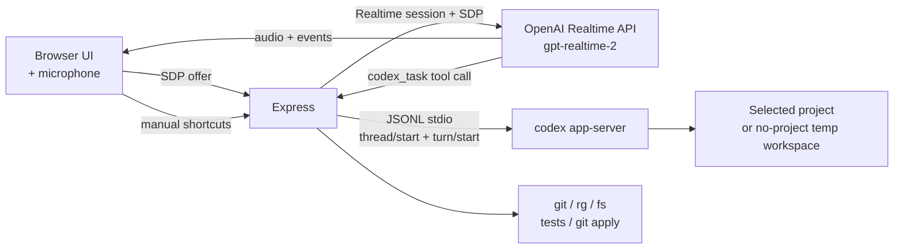

# Voice Pair Programmer

**OpenAI Realtime API (`gpt-realtime-2`)** で音声入出力を担当し、**Codex App Server** で実コーディング(リポジトリ調査・コマンド実行・ファイル編集)を担当する、二系統構成の検証用プロトタイプです。

ブラウザのマイクで話しかけると、音声は WebRTC で直接 Realtime API に流れて応答が返ります。Codex に作業をさせたい指示は、Realtime のターン経由で Codex App Server に転送され、結果は承認 UI 経由でユーザーに確認されます。

プロジェクト未選択でも会話だけを試せます。実装やリポジトリ調査を行う場合は、先にローカル Git リポジトリをプロジェクトとして選択します。

> 🔬 これは検証用リポジトリです。実プロダクトではなく、**GPT-Realtime-2 と Codex App Server を組み合わせた音声ペアプログラミング** の操作感・実装パターンを確かめることを目的にしています。

## 役割分担

| コンポーネント | 担当 | 認証 |
| --- | --- | --- |
| **OpenAI Realtime API (`gpt-realtime-2`)** | 音声の入出力(WebRTC ↔ ブラウザ) | `OPENAI_API_KEY`(`.env`) |
| **Codex App Server** (`codex app-server`) | リポジトリ調査・コマンド実行・ファイル編集 | Codex CLI のログイン情報 |
| **Express (このアプリ)** | 両者を橋渡し、承認 UI、プロジェクト管理 | — |

---

## 目次

1. [できること](#できること)
2. [必要なもの](#必要なもの)
3. [3 分セットアップ](#3-分セットアップ)
4. [初回起動と最短の使い方](#初回起動と最短の使い方)
5. [プロジェクトの追加と切り替え](#プロジェクトの追加と切り替え)
6. [音声プリセット (Voice profile)](#音声プリセット-voice-profile)
7. [試してほしいプロンプト](#試してほしいプロンプト)
8. [承認フロー](#承認フロー)
9. [環境変数リファレンス](#環境変数リファレンス)
10. [トラブルシューティング](#トラブルシューティング)
11. [アーキテクチャ](#アーキテクチャ)
12. [安全モデル](#安全モデル)

---

## できること

- **ブラウザ ↔ OpenAI Realtime API** の WebRTC 音声セッション(`gpt-realtime-2`)
- **Codex App Server** によるスレッド、ターン、会話履歴、ストリーミング応答
- **Codex による調査・実装**: プロジェクト選択後、Codex エージェントがリポジトリを読みつつ、コマンド実行やファイル編集を承認 UI 経由で提案
- **承認 UI**: Codex から届くコマンド実行 / ファイル変更リクエストを、`APPROVE` / `SESSION` / `DECLINE` で対話的に処理
- **テキスト入力** によるフォールバック(声を出せない場面用)
- **Voice profile**: 5 種類のブラウザ側エフェクト(無線風、ロボ風など)
- **複数プロジェクト対応**: ローカル Git リポジトリを登録して切り替え

### UI からのワンクリックショートカット

Codex セッションとは独立して、Express が直接実行するユーティリティが画面下部にあります。

| ボタン | 内容 |
| --- | --- |
| `INSPECT` | `git status` を実行して結果をログ表示 |
| `TESTS` | `npm test`(または `TEST_COMMAND`)を実行 |

これらは Codex のターンを介さず、サーバー側のローカルツール (`workspace_status`, `run_tests` 等) を直接叩きます。声でも `"テストを実行して"` のようにお願いできますが、その場合は Codex がコマンド実行リクエストを承認 UI に送ってくる流れになります。

---

## 必要なもの

| ツール / アカウント | 用途 |
| --- | --- |
| **Node.js 20+** | サーバー / クライアント実行 |
| **npm** | 依存インストール |
| **Codex CLI** | `codex app-server` の起動(コーディング側) |
| **`rg` (ripgrep)** | `search_workspace` ツールに必須 |
| **OpenAI API キー(`gpt-realtime-2` 利用可)** | 音声セッション(Realtime API)の認証 |
| **Codex のログイン** | Codex App Server の認証 |
| **モダンブラウザ** | WebRTC + Web Audio (Chrome / Edge / Safari) |

> ⚠️ `gpt-realtime-2` は OpenAI Realtime API 経由で利用するモデルです。プロジェクトに **Realtime API へのアクセス権** と **`gpt-realtime-2` の利用権限** が付与されている必要があります。組織やプロジェクトのアクセス状況は OpenAI ダッシュボードで確認してください。

`rg` のインストール例:

```bash
# macOS
brew install ripgrep
# Ubuntu / Debian
sudo apt install ripgrep
```

### 認証は 2 系統

このアプリは **音声 = Realtime API** と **コーディング = Codex App Server** の二系統で動くため、認証も 2 つ必要です。

#### 1. Realtime API 用の `OPENAI_API_KEY`(音声用)

ブラウザマイクからの音声セッションは、Express が **OpenAI Realtime API (`/v1/realtime/calls`) を直接叩きます**。サーバー起動時に `.env` から `OPENAI_API_KEY` を読み込み、`Authorization: Bearer …` ヘッダで使います。

OpenAI ダッシュボード → **API keys** から発行したキーを `.env` に書きます:

```bash
# .env
OPENAI_API_KEY=sk-proj-...
OPENAI_REALTIME_MODEL=gpt-realtime-2
OPENAI_REALTIME_VOICE=marin
```

API キーは **サーバー側にしか存在しません**(ブラウザには SDP 応答だけが返ります)。

#### 2. Codex CLI のログイン(コーディング用)

`npm run dev` を起動する **前に** Codex CLI の認証を済ませておきます。

```bash
# 1. Codex CLI をインストール (未インストールの場合)
npm install -g @openai/codex

# 2. ログイン (ブラウザが開きます)
codex login

# 3. 動作確認 — プロンプトが出れば認証 OK
codex
```

`codex` を素で叩いてプロンプトが返ってくれば、`codex app-server` も同じ認証情報で動きます。Codex 側は CLI のログイン情報を使うので、`.env` の `OPENAI_API_KEY` は読みません(Realtime API 用に独立して必要)。

---

## 3 分セットアップ

```bash
# 1. クローンして依存をインストール
npm install

# 2. 環境変数ファイルを作成
cp .env.example .env

# 3. 必要に応じて .env を編集
$EDITOR .env

# 4. 開発サーバー起動
npm run dev
```

ブラウザで **<http://localhost:8787>** を開きます。

---

## 初回起動と最短の使い方

1. ブラウザで **<http://localhost:8787>** を開く
2. 画面右上のステータスが **`IDLE`** になっていることを確認
3. **`CONNECT`** ボタン(緑のボタン)をクリック
4. 初回はマイク許可ダイアログが出るので **許可** する
5. ステータスが **`CONNECTED`** に変われば接続完了
6. マイクに向かって話しかける、もしくは下部の入力欄からテキスト送信

最初は試しに次のように話しかけてみてください:

> "Hello, are you there?"

応答が音声で返ってきたら成功です。プロジェクトを選んでいない状態でも音声チャットだけは動きます。

接続を切るときは **`DISCONNECT`** をクリック。マイクをミュートしたいときは **`MUTE`**。

---

## プロジェクトの追加と切り替え

リポジトリ調査や実装を試すには、対象の Git リポジトリを登録する必要があります。

### UI から探して追加

1. **Current repository** パネルの **`Find repositories`** ボタンをクリック
2. `PROJECT_SEARCH_ROOTS` で指定したディレクトリ配下から Git リポジトリを自動検出
   - 未指定の場合は、このアプリのリポジトリの親ディレクトリを検索します
3. 一覧から選んで追加

### 切り替え

セレクタから既存プロジェクトを選ぶだけ。プロジェクトを切り替えると:

- 進行中の GPT-Realtime-2 音声セッションは自動で **切断**
- 未承認のパッチは **クリア**
- 次回 `CONNECT` 時に新しいプロジェクトのコンテキストでセッションが始まる

プロジェクト一覧はサーバー側の `PROJECTS_FILE`(既定: `.voice-pair-programmer/projects.json`)に保存されます。

---

## 音声プリセット (Voice profile)

**Voice profile** パネルで、GPT-Realtime-2 からの応答音声にブラウザ側エフェクトをかけられます。Realtime API の音声プリセット自体は変えないので、**接続中でも切り替え可能** です。

| プリセット | 雰囲気 |
| --- | --- |
| `Natural` | エフェクトなしのクリーン音声 |
| `Console AI` | 帯域を狭めた無線風 |
| `Starship` | 軽いディレイ + プレゼンス強調(コマンドデッキ風) |
| `Synthetic` | 軽い歪みを加えた機械的トーン |
| `Low Orbit` | フィルタを深くかけた低周波寄り |

---

## 試してほしいプロンプト

接続後、マイクまたはテキスト欄からどうぞ:

```
このリポジトリを調べて、どんなプロジェクトか教えて
```

```
認証周りのエラーハンドリングを検索して
```

```
サーバーのエントリポイントを読んで、リクエストの流れを要約して
```

```
テストを実行して
```

```
README の最初の見出しの直後に、簡単な紹介文を追加して
```

(↑ Codex がファイル変更リクエストを承認 UI に送ってくるので、内容を見て `APPROVE` するか `DECLINE` してください)

UI 下部の **`INSPECT`** / **`TESTS`** ボタンは、Codex を経由せずローカルツールを直接呼ぶショートカットです。

---

## 承認フロー

Codex がリポジトリに対して **コマンドを実行したり、ファイルを編集したりする** ときは、必ず承認リクエストが画面右側のパネルに届きます。**承認するまで Codex は何も書き込めません**。

### パネルの表示内容

承認待ちが 1 件以上あると、右側パネルが自動的に **`Codex approval`** 表示に切り替わります(承認なしの間は `Pending patch` 状態)。表示される情報:

- **kind**: `command` / `file change`(現行 Codex から)、`command legacy` / `file change legacy`(旧 RPC からのフォールバック。通常は発火しません)
- **reason**: Codex が説明する目的(任意)
- **cwd / root**: 実行ディレクトリ、または変更を許可するルート
- **command**: 実行されるシェルコマンド(該当時)
- **diff**: 変更内容の統一 diff(`item/fileChange/patchUpdated` 通知から自動合流)

### 3 つの判断

| ボタン | 意味 | スコープ |
| --- | --- | --- |
| **`APPROVE`** | この 1 回だけ許可 | 単発 |
| **`SESSION`** | 同種の操作をこのセッション中まとめて許可 | 現在の Codex スレッドが終わるまで |
| **`DECLINE`** | 拒否(Codex は別の手段を試すか、諦める) | — |

`SESSION` は便利ですが、強い権限を渡すことになるので、信頼できる範囲のオペレーションだけに使ってください。プロジェクトを切り替えると承認キューも自動でクリアされます。

### 承認パネルと旧 `// PATCH` パネルの関係

右側のパネルは **同じ場所** で 2 種類の情報を切り替えて表示します。

1. **Codex 承認(優先)**: Codex から承認リクエストが来ているとき
2. **旧 `propose_patch` パッチ**: 内部 API 経由でローカル `propose_patch` ツールが呼ばれたとき(現状の Codex セッションでは使われません。レガシー UI として残しています)

承認リクエストが複数ある場合は右上に `1/3` のような現在位置と件数が出ます。パネル内の前後ボタンでキューを移動でき、1 件処理すると残りの承認に切り替わります。

### 注意点

- 承認待ちはサーバーのメモリにしか保持されないため、**`npm run dev` を再起動すると承認キューは消えます**(Codex プロセスごと再起動されるので実害は少ないですが、長時間放置せず判断してください)
- 承認 UI は 1.5 秒間隔のポーリングで更新されます。リクエストが届いてから表示まで最大 1.5 秒の遅延があります(将来的に SSE への置き換えを検討中)

---

## 環境変数リファレンス

`.env` で設定できる項目:

| 変数 | 必須 | 既定値 | 説明 |
| --- | --- | --- | --- |
| `OPENAI_API_KEY` | ✅ | — | GPT-Realtime-2 音声セッション用の OpenAI API キー |
| `OPENAI_REALTIME_MODEL` |   | `gpt-realtime-2` | 音声会話に使う Realtime モデル |
| `OPENAI_REALTIME_VOICE` |   | `marin` | GPT-Realtime-2 の音声プリセット (`marin`, `cedar`, `alloy` など) |
| `CODEX_MODEL` |   | `gpt-5.3-codex` | Codex App Server のコーディング用モデル。グローバル Codex 設定より優先 |
| `WORKSPACE_ROOT` |   | `process.cwd()` | 古い保存データの自動整理に使う既定ワークスペース |
| `NO_PROJECT_WORKSPACE` |   | OS の一時ディレクトリ配下 | プロジェクト未選択時に Codex App Server が使う空の作業ディレクトリ |
| `PROJECTS_FILE` |   | `.voice-pair-programmer/projects.json` | 登録済みプロジェクトの保存先 |
| `PROJECT_SEARCH_ROOTS` |   | このリポジトリの親ディレクトリ | `Find repositories` の検索対象。`:` または `;` 区切りで複数指定可 |
| `TEST_COMMAND` |   | `npm test` | `run_tests` ツールが実行するコマンド |
| `PORT` |   | `8787` | 開発サーバーのポート |

`.env.example` をコピーしてから編集するのが一番手早いです。

---

## トラブルシューティング

### `CONNECT` を押すと `OPENAI_API_KEY is required` と返る

`.env` に `OPENAI_API_KEY` が入っていません。Realtime API 側の認証が未設定の状態です。`.env.example` をコピーして、OpenAI ダッシュボードで発行したキーを貼り付け、`npm run dev` を再起動してください。

### `CONNECT` を押すと `insufficient_quota` が返る

OpenAI 側のクレジット不足、またはプロジェクト/組織のスペンドリミットに到達しています。

1. OpenAI ダッシュボードで請求情報・残クレジット・上限額を確認
2. 上限を上げるかクレジットを追加
3. **`npm run dev` を再起動**(`.env` の再読込のため)
4. 改めて **`CONNECT`**

### `CONNECT` を押すとモデル名やアクセス権関連のエラーが返る

`gpt-realtime-2` を呼べる権限がプロジェクトに無い可能性があります。OpenAI ダッシュボードで Realtime API と `gpt-realtime-2` のアクセス状況を確認してください。組織やプロジェクト単位で権限が分かれていることがあるので、`OPENAI_API_KEY` を発行したプロジェクトが正しいかも併せて確認します。

### `CONNECT` 時に Codex App Server の認証エラーが出る

Codex CLI の認証が通っていない可能性が高いです。

1. ターミナルで `codex` を実行 → プロンプトが表示されれば認証 OK
2. プロンプトが出ずにログインを促された場合は、`codex login` を実行してブラウザで認証
3. `which codex` で PATH に通っていることを確認(`npm install -g @openai/codex`)
4. **`npm run dev` を再起動**(子プロセスとして `codex app-server` を起動し直すため)
5. 改めて **`CONNECT`**

### `codex app-server` がそもそも起動しない

サーバー起動時のログに `codex` の起動失敗が出ている場合、Codex CLI が古い可能性があります。`npm install -g @openai/codex@latest` で更新してください。

### `gpt-5.5` requires a newer version of Codex と表示される

グローバル Codex 設定の既定モデルが、手元の Codex CLI より新しい場合に発生します。このアプリは既定で `CODEX_MODEL=gpt-5.3-codex` を明示して回避します。別モデルを使う場合は `.env` に `CODEX_MODEL=...` を指定してください。

### マイクが認識されない

- ブラウザのアドレスバーから localhost のマイク権限を確認
- macOS の場合、システム設定 → プライバシーとセキュリティ → マイク でブラウザを許可

### `search_workspace` が動かない

`rg` (ripgrep) が PATH に通っているか確認してください。

```bash
which rg
```

### 接続できたのに音声が再生されない

音声再生はブラウザのユーザー操作が必要です。`CONNECT` ボタンのクリック以外で接続している場合や、別タブで自動再生がブロックされていると無音になります。一度 `DISCONNECT` してから `CONNECT` を押し直してください。

---

## アーキテクチャ



- ブラウザは **SDP オファー** を Express に送る
- Express は OpenAI Realtime API (`gpt-realtime-2`) にセッションを作り、**SDP アンサー** をブラウザへ返す
- 音声と realtime events は **ブラウザ ↔ GPT-Realtime-2** でやり取りする
- GPT-Realtime-2 がコーディング作業を必要と判断したら `codex_task` tool call を出し、Express が Codex App Server の `turn/start` に委譲する
- テキストのみの送信は、接続中は GPT-Realtime-2 の data channel、未接続時は Codex App Server の `turn/start` を使う
- プロジェクト未選択時は一時ディレクトリのスレッドとして起動し、実装作業は選択済みプロジェクトでのみ行う

---

## 安全モデル

| 操作 | 実行タイミング |
| --- | --- |
| ローカルショートカットツール (`INSPECT` / `TESTS` ボタンや内部 API 直叩き) | クリック時に即実行(Codex を経由しない) |
| Codex のコマンド実行 / ファイル変更 | 承認 UI に表示し、`APPROVE` / `SESSION` / `DECLINE` を Codex App Server に返す。**`APPROVE` または `SESSION` を押すまで実行されない** |
| 旧ローカルツールのファイル変更 (`propose_patch`) | パッチを **保留**。UI で `APPLY` を押すまで適用されない(現状の Codex セッションでは発火しません) |

`run_tests` はテストコマンドを実行するため、テストが副作用を持つプロジェクトでは挙動を確認した上で利用してください。

このアプリは **ローカル開発用プロトタイプ** です。閲覧・実行されてよいリポジトリだけを登録してください。

---

## ライセンス / 注意事項

- 検証用コードのため、本番運用は想定していません
- Codex / OpenAI の利用料金は利用中のアカウントとプランに従います
- パッチ適用は `git apply` を使うため、対象は Git ワーキングツリー配下のみ
