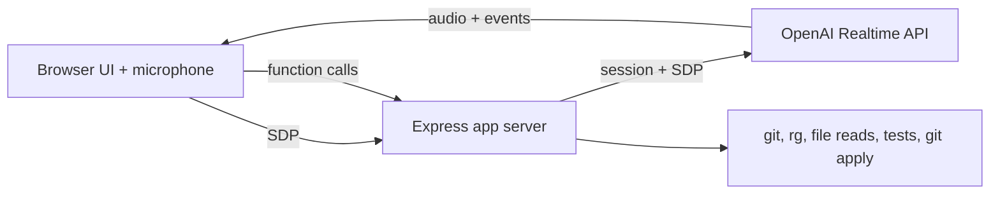

# Voice Pair Programmer

Voice Pair Programmer is a local voice coding assistant prototype built with Codex App Server patterns and the OpenAI Realtime API. It connects a browser microphone to `gpt-realtime-2`, lets the model inspect a local repository through server-side tools, and requires human approval before applying generated patches.

## What works in this MVP

- WebRTC speech-to-speech session through `/v1/realtime/calls`
- Local workspace tools: git status, ripgrep search, file read, git diff, test command
- Realtime function calling over the WebRTC data channel
- Patch proposals shown in the UI before they can be applied
- Text fallback input for cases where voice is inconvenient

## Setup

```bash
npm install
cp .env.example .env
```

Edit `.env`:

```bash
OPENAI_API_KEY=sk-proj-...
OPENAI_REALTIME_MODEL=gpt-realtime-2
OPENAI_REALTIME_VOICE=marin
WORKSPACE_ROOT=/absolute/path/to/a/local/repo
PROJECTS_FILE=.voice-pair-programmer/projects.json
PORT=8787
```

Then run:

```bash
npm run dev
```

Open `http://localhost:8787`, click **Connect**, and allow microphone access.

## Projects

The app starts with `WORKSPACE_ROOT` as the first project. From the **Work in a project** panel you can:

- choose a previously added project
- add a new project by absolute path
- reconnect Realtime against the selected project

Project entries are stored server-side in `PROJECTS_FILE`. Switching projects clears any pending patch and disconnects the current Realtime session so the next session starts with the correct repository context.

## Useful prompts

- "Inspect this repository and tell me what kind of project it is."
- "Search for the error handling around authentication."
- "Read the main server entrypoint and summarize the request flow."
- "Run the tests."
- "Propose a patch for the failing test, but do not apply it."

## Troubleshooting

### `insufficient_quota` on Connect

This error comes from the OpenAI API before the WebRTC session is created. Check that the API key belongs to a project with available credits and that the organization or project has not hit its monthly spend limit. After updating billing or limits, restart the dev server so it reloads `.env`, then click **Connect** again.

## Safety model

Read-only operations can run directly. File changes go through `propose_patch`, which stores a unified diff as a pending patch. The patch is only applied when a human clicks **Apply** in the UI.

This is still a local development prototype. Point `WORKSPACE_ROOT` only at repositories you are comfortable letting the app inspect.

## Architecture



## Notes

- The app uses the server-side unified WebRTC connection flow so the OpenAI API key never leaves the backend.
- `TEST_COMMAND` can override the default `npm test` command.
- `rg` must be installed for workspace search.
