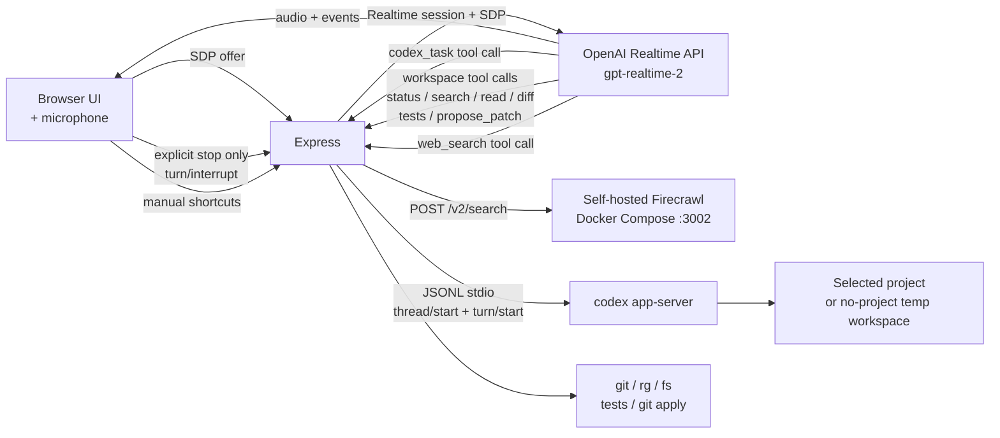

# Voice Pair Programmer

This proof-of-concept prototype uses the **OpenAI Realtime API (`gpt-realtime-2`)** for voice input and output, **self-hosted Firecrawl** for web search, and the **Codex CLI `codex app-server`** for actual coding work such as repository investigation, command execution, and file editing.

When you speak through the browser microphone, audio is sent directly to the Realtime API over WebRTC and the response is played back. Requests that require Codex are forwarded from the Realtime turn to `codex app-server`, and the resulting operations can be reviewed through the approval UI.

You can try voice conversation without selecting a project. To investigate or modify a repository, first select a local Git repository as the active project.

> 🔬 This is an experimental repository, not a production application. Its purpose is to evaluate the interaction model and implementation patterns for **voice pair programming with GPT-Realtime-2 and `codex app-server`**. It does not integrate directly with the Codex App UI or its remote-project features.

## Responsibilities

| Component | Responsibility | Authentication |
| --- | --- | --- |
| **OpenAI Realtime API (`gpt-realtime-2`)** | Voice input and output over WebRTC | `OPENAI_API_KEY` in `.env` |
| **Self-hosted Firecrawl** (Docker Compose, `POST /v2/search`) | External web information through `web_search` | None for the local stack; `FIRECRAWL_API_KEY` when authentication is enabled |
| **Codex CLI app-server** (`codex app-server --listen stdio://`) | Repository investigation, command execution, and file editing | Codex CLI login |
| **Express application** | Connects the services, hosts the approval UI, and manages projects | — |

---

## Table of Contents

1. [Features](#features)
2. [Realtime Tools](#realtime-tools)
3. [Requirements](#requirements)
4. [Setting Up Self-Hosted Firecrawl with Docker](#setting-up-self-hosted-firecrawl-with-docker)
5. [3-Minute Setup](#3-minute-setup)
6. [First Launch and Quick Start](#first-launch-and-quick-start)
7. [Adding and Switching Projects](#adding-and-switching-projects)
8. [Voice Profiles](#voice-profiles)
9. [Suggested Prompts](#suggested-prompts)
10. [Voice Interruption and Codex Tasks](#voice-interruption-and-codex-tasks)
11. [Approval Flow](#approval-flow)
12. [Environment Variable Reference](#environment-variable-reference)
13. [End-to-End Testing](#end-to-end-testing)
14. [Troubleshooting](#troubleshooting)
15. [Architecture](#architecture)
16. [Safety Model](#safety-model)

---

## Features

- **Browser ↔ OpenAI Realtime API** WebRTC voice sessions using `gpt-realtime-2`
- **Codex CLI app-server** threads, turns, conversation history, and streaming responses
- **Codex-powered investigation and implementation**: after selecting a project, the Codex agent can read the repository and propose commands or file edits through the approval UI
- **Fast local workspace tools by voice**: Elva can call `workspace_status`, `search_workspace`, `read_file`, `git_diff`, `run_tests`, and `propose_patch` directly for quick answers, and delegates real coding work to `codex_task`
- **Web search through self-hosted Firecrawl**: the `web_search` tool answers questions about current or external information without going through Codex
- **Approval UI**: interactively handle Codex command and file-change requests with `APPROVE`, `SESSION`, or `DECLINE`
- **Voice interruption**: speaking stops only the currently playing audio; an active Codex task continues unless you explicitly ask to stop it
- **Text-input fallback** for situations where speaking is not practical
- **Voice profiles**: five browser-side effects, including radio-style and robotic voices
- **Multiple projects**: register and switch between local Git repositories

### One-Click UI Shortcuts

Utilities that Express runs directly, independently of the Codex session, appear at the bottom of the screen.

| Button | Action |
| --- | --- |
| `INSPECT` | Runs `git status` and displays the result in the log |
| `TESTS` | Runs `npm test`, or the command configured in `TEST_COMMAND` |

These shortcuts call server-side local tools such as `workspace_status` and `run_tests` without creating a Codex turn.

The same local tools are registered with the Realtime model, so you can also ask by voice, for example `"Run the tests"`. Elva then calls `run_tests` directly and it runs immediately, without an approval prompt. See [Realtime Tools](#realtime-tools).

---

## Realtime Tools

Every tool the application implements is registered with the Realtime session, so Elva can answer directly instead of routing every request through Codex. The registry lives in `REALTIME_TOOLS` in `src/server/realtime.ts` and is sent both in the SDP exchange and again as `session.update` when the data channel opens. Elva's static voice instructions live in `src/server/prompts/elva.md`; the server appends the current project context at runtime.

| Tool | What it does | Approval | Needs a project |
| --- | --- | --- | --- |
| `codex_task` | Delegates implementation, multi-step investigation, refactoring, and arbitrary commands to `codex app-server` | Codex requests approval per command or file change | Recommended; without one Codex works in a temporary directory |
| `workspace_status` | `git status --short` plus the tracked file list | None, read-only | Yes |
| `search_workspace` | ripgrep search returning file, line number, and matching line | None, read-only | Yes |
| `read_file` | Returns one file's contents, workspace-relative path only, large files rejected | None, read-only | Yes |
| `git_diff` | Uncommitted working-tree diff | None, read-only | Yes |
| `run_tests` | Runs `TEST_COMMAND`, default `npm test` | **None. Runs immediately** | Yes |
| `propose_patch` | Stages a unified diff in the patch panel | **Staged only.** Nothing is written until you press `APPLY` | Yes |
| `web_search` | Firecrawl `POST /v2/search` | None, read-only and outbound | No |

The session instructions tell Elva to prefer the fast read-only tools when they answer the question directly, and to hand anything involving edits, multi-file reasoning, or non-test commands to `codex_task`. Model behavior is guidance, not enforcement; the guarantees are the ones in the Approval and Needs a project columns, which the server enforces in `src/server/tools.ts`.

Project scoping is enforced server-side: with no project selected, all six workspace tools return `No project is selected.` and do nothing. Paths are resolved inside the selected project only, so absolute paths and `../` traversal are rejected or clamped.

> ⚠️ `run_tests` is the one tool the model can trigger that executes a command with no approval step. It runs the same command as the `TESTS` button, in the selected project. If your test command has side effects, set `TEST_COMMAND` to something safe or expect that saying "Elva, run the tests" will run it.

Confirm what the model actually received by looking for this line in the connection log:

```
Realtime tools registered: codex_task, workspace_status, search_workspace, read_file, git_diff, run_tests, propose_patch, web_search.
```

---

## Requirements

| Tool or Account | Purpose |
| --- | --- |
| **Node.js 20+** | Runs the server and client |
| **npm** | Installs dependencies |
| **Codex CLI** | Starts `codex app-server` for coding tasks |
| **Docker Engine (or Docker Desktop) with Compose v2** | Runs the self-hosted Firecrawl stack used by `web_search` |
| **`rg` (ripgrep)** | Required by the `search_workspace` tool |
| **OpenAI API key with access to `gpt-realtime-2`** | Authenticates Realtime API voice sessions |
| **Codex login** | Authenticates Codex CLI app-server |
| **Modern browser** | WebRTC and Web Audio support; Chrome, Edge, or Safari |

> ⚠️ `gpt-realtime-2` is accessed through the OpenAI Realtime API. Your project must have access to both the **Realtime API** and the **`gpt-realtime-2` model**. Check the organization and project access settings in the OpenAI dashboard.

Example `rg` installation commands:

```bash
# macOS
brew install ripgrep
# Ubuntu / Debian
sudo apt install ripgrep
```

### Two Authentication Paths

The application uses two independent authentication paths: **voice through the Realtime API** and **coding through Codex CLI app-server**.

#### 1. `OPENAI_API_KEY` for the Realtime API

Express calls the **OpenAI Realtime API (`/v1/realtime/calls`) directly** for browser microphone sessions. At startup, the server reads `OPENAI_API_KEY` from `.env` and sends it in the `Authorization: Bearer …` header.

Create a key under **API keys** in the OpenAI dashboard and add it to `.env`:

```bash
# .env
OPENAI_API_KEY=sk-proj-...
OPENAI_REALTIME_MODEL=gpt-realtime-2
OPENAI_REALTIME_VOICE=marin
```

The API key remains **server-side only**. The browser receives only the SDP response.

`web_search` does not use the OpenAI Responses API. It calls a **self-hosted Firecrawl** instance at `FIRECRAWL_BASE_URL`, which defaults to `http://localhost:3002`. See [Setting Up Self-Hosted Firecrawl with Docker](#setting-up-self-hosted-firecrawl-with-docker).

#### 2. Codex CLI Login for Coding

Authenticate Codex CLI **before** starting `npm run dev`.

```bash
# 1. Install Codex CLI if necessary
npm install -g @openai/codex

# 2. Log in; a browser window opens
codex login

# 3. Verify the login; authentication is working if the prompt appears
codex
```

If running `codex` directly produces a prompt, `codex app-server` can use the same credentials. Codex uses the CLI login and does not read `OPENAI_API_KEY` from `.env`; the API key is independently required for the Realtime API.

#### 3. Optional Local Gateway Configuration

When `OPENAI_BASE_URL` points to something other than OpenAI, such as an internal gateway, that gateway must satisfy the requirements for both the voice and coding paths.

| Path | Requirement |
| --- | --- |
| Voice through Realtime | The gateway must implement `POST {OPENAI_BASE_URL}/v1/realtime/calls` and accept multipart form data containing `sdp` and `session`. `OPENAI_API_KEY` becomes the gateway credential |
| Web search through Firecrawl | Uses `POST /v2/search` at `FIRECRAWL_BASE_URL`; it does not use `OPENAI_BASE_URL` or Codex App Server |
| Coding through Codex | Define `[model_providers.<name>]` in `~/.codex/config.toml` and select it with `CODEX_MODEL_PROVIDER`. The provider must expose the endpoint required by its `wire_api`, such as `POST /v1/responses` for `responses` |
| Authentication | If the provider declares `env_key`, add that environment variable to `.env`; `codex app-server` inherits the server process environment |

If a gateway ignores the `session` part of the SDP exchange, the model will not receive its tools and may respond that it does not know the tool. The application sends the same configuration again with `session.update` immediately after the data channel opens. Confirm registration by looking for the `Realtime tools registered: …` line in the connection log; it should list all eight tools from [Realtime Tools](#realtime-tools).

---

## Setting Up Self-Hosted Firecrawl with Docker

The `web_search` tool calls `POST /v2/search` on a Firecrawl instance that you run locally with Docker Compose. Firecrawl is a **separate repository** from this application; install it once, then leave the stack running while you use voice pair programming.

Voice conversation and Codex coding work without Firecrawl. Only `web_search` fails when the stack is down.

### 1. Check the prerequisites

```bash
docker --version
docker compose version
```

Docker Compose must be v2, invoked as `docker compose` rather than `docker-compose`. Port `3002` must be free, and Docker needs enough CPU, memory, and disk to build and run several containers.

### 2. Clone Firecrawl outside this repository

```bash
cd ~/myapps
git clone https://github.com/firecrawl/firecrawl.git
cd firecrawl
```

The official guide pins release `v2.11.162`. Pinning a known release keeps the Compose contract and environment variables predictable:

```bash
git checkout v2.11.162
```

### 3. Create the Firecrawl `.env`

Create a minimal `.env` in the **Firecrawl** repository root, not in this application's directory:

```bash
# firecrawl/.env
NUM_WORKERS_PER_QUEUE=8
PORT=3002
HOST=0.0.0.0

# No API key required for local use.
USE_DB_AUTHENTICATION=false

REDIS_URL=redis://redis:6379
REDIS_RATE_LIMIT_URL=redis://redis:6379
PLAYWRIGHT_MICROSERVICE_URL=http://playwright-service:3000/scrape

# PostgreSQL-backed queue. Replace the password before starting the stack.
POSTGRES_USER=postgres
POSTGRES_PASSWORD=change-me
POSTGRES_DB=postgres
```

Notes from the official self-hosting guide:

- Keep `POSTGRES_DB=postgres` on `v2.11.162`, because the bundled `pg_cron` configuration targets that database.
- Leave `NUQ_BACKEND` and `BULL_AUTH_KEY` unset for the first run.
- Use the Compose service name `redis://redis:6379`. `localhost` resolves inside the container, not to the Redis service.
- Do not commit `.env`.

### 4. Build and start the stack

```bash
docker compose up -d --build
docker compose ps --all
```

The first build takes several minutes. Warnings about unset optional variables are expected. Long-running services should report as running, and one-shot initialization services should report as completed.

### 5. Verify that search works

```bash
# Reachability
curl http://localhost:3002/v0/health/readiness

# The endpoint this application actually calls
curl -X POST http://localhost:3002/v2/search \
  -H 'Content-Type: application/json' \
  -d '{"query":"openai realtime api","limit":3,"sources":["web"]}'
```

A successful response contains a `data.web` array of results with `title`, `url`, and `description`. That is exactly the shape `src/server/webSearch.ts` parses, so if this `curl` succeeds, `web_search` works.

### 6. Point this application at the instance

Nothing is required when Firecrawl runs on the default port. To use another host or port, set it in **this application's** `.env`:

```bash
# .env
FIRECRAWL_BASE_URL=http://localhost:3002
# Only for deployments with authentication enabled
# FIRECRAWL_API_KEY=fc-...
```

`FIRECRAWL_BASE_URL` accepts an origin such as `http://localhost:3002` or a URL already ending in `/v2`. The server appends `/v2/search` when needed. When `FIRECRAWL_API_KEY` is set, it is sent as `Authorization: Bearer …`.

Restart `npm run dev` after changing `.env`, and confirm the startup log line:

```
Firecrawl URL: http://localhost:3002
```

### Stopping and restarting

```bash
# Stop
cd /path/to/firecrawl && docker compose down

# Start again
docker compose up -d
```

> ⚠️ The local baseline runs with `USE_DB_AUTHENTICATION=false`, so the API accepts unauthenticated requests. Keep it on a trusted network, such as `localhost` only. Do not expose port `3002` to the internet without adding authentication, network controls, and TLS.

Self-hosted Firecrawl does not include the Cloud-only capabilities such as Fire-engine anti-bot handling, screenshots, or page actions. Core `search`, `scrape`, `crawl`, and `map` routes are available, which is all `web_search` needs.

Reference: [Firecrawl self-hosting guide](https://docs.firecrawl.dev/contributing/self-host). Content was rephrased for compliance with licensing restrictions.

---

## 3-Minute Setup

```bash
# 1. Install dependencies after cloning the repository
npm install

# 2. Create the environment file
cp .env.example .env

# 3. Edit .env as needed
$EDITOR .env

# 4. Start the self-hosted Firecrawl stack for web_search
#    (first-time install: see "Setting Up Self-Hosted Firecrawl with Docker")
cd /path/to/firecrawl && docker compose up -d && cd -

# 5. Start the development server
npm run dev
```

Open **<http://localhost:8787>** in your browser.

---

## First Launch and Quick Start

1. Open **<http://localhost:8787>** in your browser.
2. Confirm that the status in the upper-right corner is **`IDLE`**.
3. Click the green **`CONNECT`** button.
4. Allow microphone access when the browser prompts you for permission.
5. The connection is ready when the status changes to **`CONNECTED`**. Elva automatically greets you when the voice connection is ready.
6. Speak into the microphone or send text through the input field at the bottom.

You can address the assistant by its wake name and try saying:

> "Elva, hello, are you there?"

Elva also responds when a direct question, command, or follow-up is clearly meant for her. If it is genuinely unclear, she may ask one brief clarification instead of repeatedly asking you to use her name.

If you hear a spoken response, the connection is working. Voice chat works even when no project is selected.

Click **`DISCONNECT`** to end the connection. Click **`MUTE`** to mute the microphone.

---

## Adding and Switching Projects

Register a target Git repository before trying repository investigation or implementation tasks.

### Find and Add a Repository from the UI

1. Click **`Find repositories`** in the **Current repository** panel.
2. The application scans for Git repositories under the directories configured in `PROJECT_SEARCH_ROOTS`.
   - When unset, it scans the parent directory of this application's repository.
3. Select a repository from the discovered list to add it.

### Switching Projects

Select an existing project from the selector. When you switch projects:

- The active GPT-Realtime-2 voice session is automatically **disconnected**.
- Any active Codex task is **interrupted**.
- Unapproved patches are **cleared**.
- The next `CONNECT` starts a session with the new project context.

The project list is stored server-side in `PROJECTS_FILE`, which defaults to `.voice-pair-programmer/projects.json`.

---

## Voice Profiles

The **Voice profile** panel applies browser-side effects to GPT-Realtime-2 responses. These effects do not change the Realtime API voice preset, so you can switch profiles **while connected**.

| Profile | Character |
| --- | --- |
| `Natural` | Clean audio without effects |
| `Console AI` | Narrow-band radio-style audio |
| `Starship` | Light delay and emphasized presence, similar to a command deck |
| `Synthetic` | Mechanical tone with light distortion |
| `Low Orbit` | Heavily filtered, low-frequency sound |

---

## Suggested Prompts

After connecting, try these through the microphone or text field:

```
Inspect this repository and explain what kind of project it is.
```

```
Find the error handling around authentication.
```

```
Read the server entry point and summarize the request flow.
```

```
Run the tests.
```

```
Add a short introduction immediately after the first heading in the README.
```

Which path each request takes depends on the tool Elva picks. Quick questions are answered from the fast local tools:

```
What files changed but are not committed yet?      → git_diff
Where is FIRECRAWL_BASE_URL used?                  → search_workspace
What scripts does package.json define?             → read_file
Run the tests.                                     → run_tests, runs immediately
```

Work that changes code goes to `codex_task`, and Codex then sends command or file-change requests to the approval UI. For the README example above, review the request and choose `APPROVE` or `DECLINE`. See [Realtime Tools](#realtime-tools) for the full registry and which calls bypass approval.

The **`INSPECT`** and **`TESTS`** buttons at the bottom of the UI are shortcuts that call the same local tools without going through Codex.

---

## Voice Interruption and Codex Tasks

Elva responds when you use her name or when conversational context makes it clear that a question, command, or follow-up is directed at her. She stays silent for clear background conversation or speech directed elsewhere. If the target is genuinely unclear, she may ask one brief, gentle clarification without repeatedly insisting that you say “Elva.” When you begin speaking, the application stops only the currently playing audio response. An active **Codex CLI app-server** task continues running.

To stop a Codex task, explicitly say something such as “stop,” “interrupt,” or “cancel.” Only then does the browser abort the active `codex_task` and the server send `turn/interrupt` to `codex app-server`.

---

## Approval Flow

Commands and file changes that require approval from Codex CLI app-server appear in the panel on the right. These operations are not permitted until you select `APPROVE` or `SESSION`.

This approval UI handles approval requests received from `codex app-server`. It is not a replacement for the Codex App desktop UI or every future Codex approval policy.

### Approval Panel Contents

When one or more requests are waiting, the right panel automatically switches to **`Codex approval`**. When no approvals are pending, it displays `Pending patch`. The panel shows:

- **kind**: `command` or `file change` from current Codex versions; `command legacy` or `file change legacy` as fallbacks for older RPCs, which normally do not occur
- **reason**: an optional explanation from Codex
- **cwd / root**: the command working directory or the root directory where changes are permitted
- **command**: the shell command that will run, when applicable
- **diff**: a unified diff assembled automatically from `item/fileChange/patchUpdated` notifications

### Three Decisions

| Button | Meaning | Scope |
| --- | --- | --- |
| **`APPROVE`** | Allow this operation once | Single operation |
| **`SESSION`** | Allow similar operations for the rest of the session | Until the current Codex thread ends |
| **`DECLINE`** | Reject the request; Codex may try another approach or stop | — |

`SESSION` is convenient but grants broad permission. Use it only for operations within a trusted scope. Switching projects automatically clears the approval queue.

### Relationship Between the Approval Panel and the Legacy `// PATCH` Panel

The panel on the right displays two kinds of information in the **same location**:

1. **Codex approvals, shown first**: displayed while Codex approval requests are pending
2. **`propose_patch` patches**: displayed when the local `propose_patch` tool is called, either by Elva through the Realtime session or directly through the internal API. Codex's own file changes do not use this path; they arrive as approval requests instead. A staged patch is applied only when you press `APPLY`

When multiple approval requests are pending, the upper-right corner shows the current position and count, such as `1/3`. Use the previous and next buttons to move through the queue. After one request is handled, the panel advances to the remaining requests.

### Notes

- Pending approvals exist only in server memory. **Restarting `npm run dev` clears the approval queue** because the Codex process also restarts. Avoid leaving requests unattended for long periods.
- The approval UI polls every 1.5 seconds, so a request may take up to 1.5 seconds to appear. Replacing polling with SSE is a possible future improvement.

---

## Environment Variable Reference

The following variables can be configured in `.env`:

| Variable | Required | Default | Description |
| --- | --- | --- | --- |
| `OPENAI_API_KEY` | Yes | — | OpenAI API key for GPT-Realtime-2 voice sessions |
| `OPENAI_REALTIME_MODEL` | No | `gpt-realtime-2` | Realtime model used for voice conversation |
| `OPENAI_REALTIME_VOICE` | No | `marin` | GPT-Realtime-2 voice preset, such as `marin`, `cedar`, or `alloy` |
| `FIRECRAWL_BASE_URL` | No | `http://localhost:3002` | Self-hosted Firecrawl endpoint used by `web_search`. Accepts an origin or a URL ending in `/v2`; `/v2/search` is appended as needed. Requires the [Docker stack](#setting-up-self-hosted-firecrawl-with-docker) |
| `FIRECRAWL_API_KEY` | No | — | Sent as `Authorization: Bearer …`. Only needed for Firecrawl deployments with authentication enabled; the local stack with `USE_DB_AUTHENTICATION=false` does not use it |
| `CODEX_MODEL` | No | `gpt-5.4` | Coding model for Codex CLI app-server, overriding the global Codex configuration. `gpt-5.5` is currently unsupported through app-server; see [Troubleshooting](#gpt-55-requires-a-newer-version-of-codex) |
| `CODEX_MODEL_PROVIDER` | No | — | Selects `[model_providers.<name>]` from `~/.codex/config.toml` and passes it as `codex app-server -c model_provider=<name>`. **`--profile` is unsupported by app-server**; see [Troubleshooting](#--profile-only-applies-to-runtime-commands) |
| `WORKSPACE_ROOT` | No | `process.cwd()` | Default workspace used to clean up legacy saved data |
| `NO_PROJECT_WORKSPACE` | No | Temporary OS directory | Empty scratch directory used by Codex CLI app-server when no project is selected |
| `PROJECTS_FILE` | No | `.voice-pair-programmer/projects.json` | Storage path for registered projects |
| `PROJECT_SEARCH_ROOTS` | No | Parent of this repository | Directories scanned by `Find repositories`, separated by `:` or `;` |
| `TEST_COMMAND` | No | `npm test` | Command executed by the `run_tests` tool |
| `PORT` | No | `8787` | Development server port |

If the selected `model_provider` declares `env_key`, add that environment variable to `.env`. `codex app-server` inherits the server process environment and fails with `Missing environment variable: ...` if it is absent.

```bash
# Example when [model_providers.amp] declares env_key = "AMP_BRIDGE_API_KEY"
CODEX_MODEL_PROVIDER=amp
CODEX_MODEL=<model-provided-by-that-provider>
AMP_BRIDGE_API_KEY=amp-bridge-local
```

The quickest setup is to copy `.env.example` and then edit it.

---

## End-to-End Testing

The Playwright suite launches the real Express/Vite application and a real Chromium browser. It remains deterministic by using a disposable Git repository under `.e2e/`, a fake Codex app-server executable, a local Firecrawl stub, and browser-level microphone and WebRTC fakes. The default suite does not call live OpenAI, Codex, or Firecrawl services.

Install the pinned Chromium build once, then run the suite:

```bash
npm run test:e2e:install
npm run test:e2e
```

Additional commands:

| Command | Purpose |
| --- | --- |
| `npm run test:e2e:headed` | Run with a visible Chromium window |
| `npm run test:e2e:ui` | Open Playwright's interactive UI |
| `npm run test:e2e:debug` | Start Playwright Inspector |
| `npm run test:e2e:typecheck` | Type-check the Playwright configuration and tests |

The suite covers application loading, disconnected text turns, microphone errors, the Realtime connection and one-time Elva greeting, and every registered tool: `workspace_status`, `search_workspace`, `read_file`, `git_diff`, `run_tests`, `propose_patch`, `codex_task`, and `web_search`.

It also asserts the Realtime contract itself: that `GET /api/realtime/session` exposes all eight tools with schemas the Realtime API accepts, that every tool in `WORKSPACE_TOOL_NAMES` reaches the model, that the instructions steer real work to `codex_task`, and that each workspace tool refuses to run with no project selected and stays inside the selected project for path arguments. Registering a new workspace tool without exposing it fails `npm run typecheck` through the compile-time check in `src/server/realtime.ts`.

Traces, screenshots, and videos are retained under `test-results/` when a test fails. The HTML report is written to `playwright-report/`. These directories and the disposable `.e2e/` workspace are ignored by Git.

---

## Troubleshooting

### `OPENAI_API_KEY is required` After Clicking `CONNECT`

`OPENAI_API_KEY` is missing from `.env`, so Realtime API authentication is not configured. Copy `.env.example`, add a key created in the OpenAI dashboard, and restart `npm run dev`.

### `insufficient_quota` After Clicking `CONNECT`

The OpenAI account may be out of credit or the project or organization may have reached its spending limit.

1. Check billing details, remaining credit, and spending limits in the OpenAI dashboard.
2. Increase the limit or add credit.
3. **Restart `npm run dev`** so `.env` is loaded again.
4. Click **`CONNECT`** again.

### Model-Name or Access Errors After Clicking `CONNECT`

The project may not have permission to use `gpt-realtime-2`. Check access to the Realtime API and the `gpt-realtime-2` model in the OpenAI dashboard. Access may differ by organization and project, so also verify that `OPENAI_API_KEY` was created under the intended project.

### Codex CLI app-server Authentication Error During `CONNECT`

Codex CLI is probably not authenticated.

1. Run `codex` in a terminal. Authentication is working if a prompt appears.
2. If Codex asks you to sign in instead, run `codex login` and authenticate in the browser.
3. Confirm that `codex` is on `PATH` with `which codex`; install it with `npm install -g @openai/codex` if necessary.
4. **Restart `npm run dev`** to restart the child `codex app-server` process.
5. Click **`CONNECT`** again.

### `--profile only applies to runtime commands`

Codex CLI permits `--profile` only for **runtime commands** such as `codex`, `codex exec`, `codex review`, and `codex mcp`. It is not accepted by `app-server`. In the 0.153 series, `codex --profile <name> app-server` exits immediately and `initialize` times out. `-c profile=<name>` is also rejected as a legacy setting.

To use a custom provider, select `model_provider` directly instead of using a profile:

```bash
# .env
CODEX_MODEL_PROVIDER=amp
CODEX_MODEL=<model-name-from-that-provider>
```

Internally, the application starts `codex app-server -c model_provider=<name> --listen stdio://`.

### `Missing environment variable: ...`

The `[model_providers.<name>]` entry in `~/.codex/config.toml` declares an `env_key`, but that variable is missing from the server process. Add it to `.env` and restart `npm run dev`; the child `codex app-server` process inherits the environment.

### `codex app-server` Does Not Start

If the server log reports that Codex failed to start, Codex CLI may be outdated. Update it with `npm install -g @openai/codex@latest`.

### `gpt-5.5` Requires a Newer Version of Codex

**Conclusion: this application currently cannot use `gpt-5.5`. Use `CODEX_MODEL=gpt-5.4`, which is also the default.**

#### What Is Happening

The application starts `codex app-server --listen stdio://` as a child process and opens Codex sessions through the JSON-RPC `thread/start` method. Although `gpt-5.5` works when Codex CLI is invoked directly with `codex -c model='gpt-5.5'`, it is currently unsupported through app-server when supplied as the `thread/start` model. The same error is returned even with the latest CLI.

The official OpenAI documentation also recommends continuing to use `gpt-5.4` while `gpt-5.5` remains unavailable.

#### Related Upstream Issues

- [openai/codex#19370](https://github.com/openai/codex/issues/19370) — GPT-5.5 is not usable in Codex App remote projects; unresolved
- [openai/codex-plugin-cc#270](https://github.com/openai/codex-plugin-cc/issues/270) — GPT-5.5 is unsupported by the app-server structured-output path
- [coleam00/Archon#1447](https://github.com/coleam00/Archon/issues/1447) — Codex SDK reports that GPT-5.5 requires a newer version

#### Workaround

1. Explicitly set **`CODEX_MODEL=gpt-5.4`** in `.env`; this is already the default when unset.
2. Keep Codex CLI current with `npm install -g @openai/codex@latest`.
3. If the error still occurs, the automatic recovery logic in `src/server/codex/index.ts:64-71` restarts the Codex process and retries once, so **you do not need to restart `npm run dev`**.
4. After upstream app-server support for `gpt-5.5` is fixed, switch to `CODEX_MODEL=gpt-5.5` in `.env`.

### `web_search` Fails with a Connection Error

The Firecrawl stack is probably not running.

1. Check the containers: `cd /path/to/firecrawl && docker compose ps --all`.
2. Start them if needed: `docker compose up -d`.
3. Verify reachability: `curl http://localhost:3002/v0/health/readiness`.
4. Confirm that `FIRECRAWL_BASE_URL` in `.env` matches the published port. The startup log prints `Firecrawl URL: …`.

If another process owns port `3002`, either stop it or publish Firecrawl on a different port and update `FIRECRAWL_BASE_URL`.

### `Firecrawl completed the search without returning web results.`

Firecrawl responded, but the payload contained no `data.web` entries. Common causes:

- The query was too narrow. Try a broader phrasing.
- The Firecrawl deployment cannot reach the internet. Test it directly with the `curl` command in [step 5 of the Firecrawl setup](#5-verify-that-search-works).
- The API container is up but Playwright is not. Check `docker compose logs playwright-service`.

### Firecrawl Returns 401 or 403

The deployment has authentication enabled. Set `FIRECRAWL_API_KEY` in `.env` and restart `npm run dev`. For the local stack, confirm that `USE_DB_AUTHENTICATION=false` is set in the Firecrawl `.env`.

### Microphone Is Not Detected

- Check the localhost microphone permission from the browser address bar.
- On macOS, allow the browser under **System Settings → Privacy & Security → Microphone**.

### `search_workspace` Does Not Work

Confirm that `rg` is on `PATH`:

```bash
which rg
```

### Connected but No Audio Plays

Browsers require a user gesture before playing audio. If the connection was created without clicking `CONNECT`, or another tab caused autoplay to be blocked, disconnect and click `CONNECT` again.

---

## Architecture



- The browser sends an **SDP offer** to Express.
- Express creates an OpenAI Realtime API session with `gpt-realtime-2` and returns the **SDP answer** to the browser.
- Audio and Realtime events flow between the **browser and GPT-Realtime-2**.
- When GPT-Realtime-2 determines that coding work is required, it emits a `codex_task` tool call. Express delegates the task to `turn/start` in `codex app-server`.
- For quick repository questions it calls the local workspace tools instead. Those run in Express against the selected project and return in milliseconds, without a Codex turn. See [Realtime Tools](#realtime-tools).
- When external or current information is required, it emits a `web_search` tool call instead. Express forwards it to `POST /v2/search` on the self-hosted Firecrawl instance and returns the top results with their sources. Web searches never go through Codex.
- When the user begins speaking, only the audio response is stopped. A Codex task receives `turn/interrupt` only after an explicit instruction such as “stop” or “interrupt,” or when the connection is closed.
- While connected, text-only messages use the GPT-Realtime-2 data channel. While disconnected, they use `turn/start` in `codex app-server`.
- When no project is selected, Codex starts a thread in a temporary directory. Implementation work is performed only against a selected project.

---

## Safety Model

| Operation | When It Runs |
| --- | --- |
| Local shortcut tools, including the `INSPECT` and `TESTS` buttons or direct internal API calls | Immediately when clicked, without going through Codex |
| Read-only workspace tools by voice: `workspace_status`, `search_workspace`, `read_file`, `git_diff` | Immediately, without approval. They only read inside the selected project and refuse to run when no project is selected |
| `run_tests` by voice | **Immediately, without approval.** Runs `TEST_COMMAND` in the selected project, the same command as the `TESTS` button |
| `propose_patch` by voice | Stages the diff in the patch panel. **Nothing is written until you press `APPLY`**, which then runs `git apply` in the selected project |
| `web_search` through self-hosted Firecrawl | Runs immediately without approval. It is read-only and outbound, but note that Firecrawl sends requests from your machine to the target sites |
| Voice interruption | Stops only the currently playing audio response; an active Codex task continues |
| Explicit Codex task interruption | Sends `turn/interrupt` after phrases such as “stop,” “interrupt,” or “cancel,” or when disconnecting or switching projects |
| Codex command execution and file changes | Appears in the approval UI and sends `APPROVE`, `SESSION`, or `DECLINE` to `codex app-server`. **Nothing runs until `APPROVE` or `SESSION` is selected** |

Because `run_tests` executes the configured test command and the Realtime model can call it, review the behavior of test suites that may have side effects, and set `TEST_COMMAND` accordingly.

Path handling for the workspace tools is enforced in `src/server/tools.ts`: paths are resolved against the selected project root, leading `../` segments are stripped, and anything that still lands outside the root is rejected with `Path escapes WORKSPACE_ROOT.`

This application is a **local-development prototype**. Register only repositories that the application is permitted to read and execute.

---

## License and Notes

- This is experimental code and is not intended for production use.
- Codex and OpenAI usage charges depend on the active account and plan.
- Patch application uses `git apply`, so targets are limited to the selected Git working tree.
