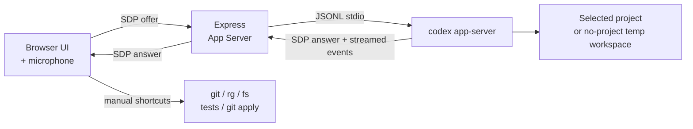

# Voice Pair Programmer

ブラウザのマイクから公式 **Codex App Server** に接続し、ローカルリポジトリを音声またはテキストで調査・実装できる検証用プロトタイプです。

プロジェクト未選択でも会話だけを試せます。実装やリポジトリ調査を行う場合は、先にローカル Git リポジトリをプロジェクトとして選択します。

> 🔬 これは検証用リポジトリです。実プロダクトではなく、Codex App Server と音声 UI を組み合わせたときの操作感・実装パターンを確かめることを目的にしています。

---

## 目次

1. [できること](#できること)
2. [必要なもの](#必要なもの)
3. [3 分セットアップ](#3-分セットアップ)
4. [初回起動と最短の使い方](#初回起動と最短の使い方)
5. [プロジェクトの追加と切り替え](#プロジェクトの追加と切り替え)
6. [音声プリセット (Voice profile)](#音声プリセット-voice-profile)
7. [試してほしいプロンプト](#試してほしいプロンプト)
8. [パッチ承認フロー](#パッチ承認フロー)
9. [環境変数リファレンス](#環境変数リファレンス)
10. [トラブルシューティング](#トラブルシューティング)
11. [アーキテクチャ](#アーキテクチャ)
12. [安全モデル](#安全モデル)

---

## できること

- **ブラウザ ↔ Express ↔ `codex app-server`** の双方向音声セッション
- **Codex App Server** によるスレッド、ターン、会話履歴、ストリーミング応答
- **Codex による調査と回答**: プロジェクト選択後、App Server の Codex エージェントが選択リポジトリを読みながら応答
- **テキスト入力** によるフォールバック(声を出せない場面用)
- **Voice profile**: 5 種類のブラウザ側エフェクト(無線風、ロボ風など)
- **複数プロジェクト対応**: ローカル Git リポジトリを登録して切り替え

### UI からのワンクリックショートカット

Codex のセッションとは別に、Express がローカルで直接実行するユーティリティです。画面下部の **`INSPECT`** / **`TESTS`** ボタンや `// PATCH` パネルがこれに該当します。

| ツール | 内容 | 起動 |
| --- | --- | --- |
| `workspace_status` | `git status` | `INSPECT` ボタン |
| `run_tests` | `npm test`(または `TEST_COMMAND`) | `TESTS` ボタン |
| `search_workspace` | `rg` による全文検索 | (内部 API) |
| `read_file` | ファイル読み取り | (内部 API) |
| `git_diff` | ワーキングツリー差分 | (内部 API) |
| `propose_patch` | 統一 diff の保留 + 承認後 `git apply` | `// PATCH` パネル |

> ℹ️ これらは **Codex から呼ばれるツールではありません**。現状は UI 側のユーティリティとして残してあるだけです。詳細は [パッチ承認フロー](#パッチ承認フロー) を参照。

---

## 必要なもの

| ツール | 用途 |
| --- | --- |
| **Node.js 20+** | サーバー / クライアント実行 |
| **npm** | 依存インストール |
| **Codex CLI** | `codex app-server` の起動 |
| **`rg` (ripgrep)** | `search_workspace` ツールに必須 |
| **Codex のログインまたは API キー設定** | Codex App Server の認証 |
| **モダンブラウザ** | WebRTC + Web Audio (Chrome / Edge / Safari) |

`rg` のインストール例:

```bash
# macOS
brew install ripgrep
# Ubuntu / Debian
sudo apt install ripgrep
```

### Codex CLI のセットアップ

`npm run dev` を起動する **前に** Codex CLI の認証を済ませておきます。

```bash
# 1. Codex CLI をインストール (未インストールの場合)
npm install -g @openai/codex

# 2. ログイン (ブラウザが開きます)
codex login

# 3. 動作確認 — プロンプトが出れば認証 OK
codex
```

`codex` を素で叩いてプロンプトが返ってくれば、`codex app-server` も同じ認証情報で動きます。API キー方式を使う場合は Codex CLI のドキュメントに従って `OPENAI_API_KEY` を設定してください。

---

## 3 分セットアップ

```bash
# 1. クローンして依存をインストール
npm install

# 2. 環境変数ファイルを作成
cp .env.example .env

# 3. 必要に応じて .env を編集
$EDITOR .env

# 4. 開発サーバー起動
npm run dev
```

ブラウザで **<http://localhost:8787>** を開きます。

---

## 初回起動と最短の使い方

1. ブラウザで **<http://localhost:8787>** を開く
2. 画面右上のステータスが **`IDLE`** になっていることを確認
3. **`CONNECT`** ボタン(緑のボタン)をクリック
4. 初回はマイク許可ダイアログが出るので **許可** する
5. ステータスが **`CONNECTED`** に変われば接続完了
6. マイクに向かって話しかける、もしくは下部の入力欄からテキスト送信

最初は試しに次のように話しかけてみてください:

> "Hello, are you there?"

応答が音声で返ってきたら成功です。プロジェクトを選んでいない状態でも音声チャットだけは動きます。

接続を切るときは **`DISCONNECT`** をクリック。マイクをミュートしたいときは **`MUTE`**。

---

## プロジェクトの追加と切り替え

リポジトリ調査や実装を試すには、対象の Git リポジトリを登録する必要があります。

### UI から探して追加

1. **Current repository** パネルの **`Find repositories`** ボタンをクリック
2. `PROJECT_SEARCH_ROOTS` で指定したディレクトリ配下から Git リポジトリを自動検出
   - 未指定の場合は、このアプリのリポジトリの親ディレクトリを検索します
3. 一覧から選んで追加

### 切り替え

セレクタから既存プロジェクトを選ぶだけ。プロジェクトを切り替えると:

- 進行中の Codex App Server realtime セッションは自動で **切断**
- 未承認のパッチは **クリア**
- 次回 `CONNECT` 時に新しいプロジェクトのコンテキストでセッションが始まる

プロジェクト一覧はサーバー側の `PROJECTS_FILE`(既定: `.voice-pair-programmer/projects.json`)に保存されます。

---

## 音声プリセット (Voice profile)

**Voice profile** パネルで、モデルからの応答音声にブラウザ側エフェクトをかけられます。Codex App Server の realtime 音声自体は変えないので、**接続中でも切り替え可能** です。

| プリセット | 雰囲気 |
| --- | --- |
| `Natural` | エフェクトなしのクリーン音声 |
| `Console AI` | 帯域を狭めた無線風 |
| `Starship` | 軽いディレイ + プレゼンス強調(コマンドデッキ風) |
| `Synthetic` | 軽い歪みを加えた機械的トーン |
| `Low Orbit` | フィルタを深くかけた低周波寄り |

---

## 試してほしいプロンプト

接続後、マイクまたはテキスト欄からどうぞ:

```
このリポジトリを調べて、どんなプロジェクトか教えて
```

```
認証周りのエラーハンドリングを検索して
```

```
サーバーのエントリポイントを読んで、リクエストの流れを要約して
```

```
テストを実行して
```

```
失敗しているテストに対するパッチを提案して。ただし適用はしないで
```

UI 下部の **`INSPECT`** / **`TESTS`** ボタンは、`workspace_status` と `run_tests` をワンクリックで叩くショートカットです。

---

## パッチ承認フロー

### 現状: Codex はファイル変更できません

Codex App Server は、ユーザーの Codex 設定に従って **コマンド実行やファイル変更の承認リクエスト** を送ります。このプロトタイプでは App Server 用の承認 UI をまだ実装していないため、**承認リクエストはサーバー側で一律に拒否** しています。

つまり今の構成では:

- ✅ Codex がリポジトリを **読む / 検索する / 説明する** はできる
- ❌ Codex が **ファイルを書き換える / シェルコマンドを実行する** はできない

「読み取り・調査専用のペアプログラマー」として動く状態です。書き込みを試したい場合は、Codex に diff を **テキストで提案させて、自分で適用** する運用になります。

### 右側の `// PATCH` パネルについて

このパネルは、Codex 移行前のローカル `propose_patch` ツール用の承認 UI です。

- **Codex セッションからは現在発火しません**(承認リクエストが拒否されるため)
- 内部 API を直接叩けば動作するため、UI は残してあります
- 将来的に App Server の承認リクエストをこのパネルに繋ぐ実装を入れれば、Codex の編集提案もここで承認できるようになります

---

## 環境変数リファレンス

`.env` で設定できる項目:

| 変数 | 必須 | 既定値 | 説明 |
| --- | --- | --- | --- |
| `OPENAI_REALTIME_VOICE` |   | `marin` | Codex App Server realtime の音声プリセット (`marin`, `cedar`, `alloy` など) |
| `WORKSPACE_ROOT` |   | `process.cwd()` | 古い保存データの自動整理に使う既定ワークスペース |
| `NO_PROJECT_WORKSPACE` |   | OS の一時ディレクトリ配下 | プロジェクト未選択時に Codex App Server が使う空の作業ディレクトリ |
| `PROJECTS_FILE` |   | `.voice-pair-programmer/projects.json` | 登録済みプロジェクトの保存先 |
| `PROJECT_SEARCH_ROOTS` |   | このリポジトリの親ディレクトリ | `Find repositories` の検索対象。`:` または `;` 区切りで複数指定可 |
| `TEST_COMMAND` |   | `npm test` | `run_tests` ツールが実行するコマンド |
| `PORT` |   | `8787` | 開発サーバーのポート |

`.env.example` をコピーしてから編集するのが一番手早いです。

---

## トラブルシューティング

### `CONNECT` を押すと Codex App Server の認証エラーが出る

Codex CLI のログインまたは API キー設定を確認してください。

1. ターミナルで `codex` が実行できることを確認
2. Codex CLI の認証状態を確認
3. **`npm run dev` を再起動**
4. 改めて **`CONNECT`**

### マイクが認識されない

- ブラウザのアドレスバーから localhost のマイク権限を確認
- macOS の場合、システム設定 → プライバシーとセキュリティ → マイク でブラウザを許可

### `search_workspace` が動かない

`rg` (ripgrep) が PATH に通っているか確認してください。

```bash
which rg
```

### 接続できたのに音声が再生されない

音声再生はブラウザのユーザー操作が必要です。`CONNECT` ボタンのクリック以外で接続している場合や、別タブで自動再生がブロックされていると無音になります。一度 `DISCONNECT` してから `CONNECT` を押し直してください。

---

## アーキテクチャ



- ブラウザは **SDP オファー** を Express に送る
- Express は `codex app-server --listen stdio://` を起動し、JSONL の JSON-RPC で `initialize` / `thread/start` / `thread/realtime/start` を呼ぶ
- App Server から返る **SDP アンサー** を Express がブラウザへ返す
- テキストのみの送信は `turn/start` を使い、App Server の `item/agentMessage/delta` を集約して UI に表示する
- プロジェクト未選択時は一時ディレクトリのスレッドとして起動し、実装作業は選択済みプロジェクトでのみ行う

---

## 安全モデル

| 操作 | 実行タイミング |
| --- | --- |
| 読み取り系ツール (`workspace_status`, `search_workspace`, `read_file`, `git_diff`, `run_tests`) | モデルからの呼び出しで即実行 |
| Codex App Server のコマンド実行 / ファイル変更承認 | 現状はサーバー側で拒否 |
| 旧ローカルツールのファイル変更 (`propose_patch`) | パッチを **保留**。UI で `APPLY` を押すまで適用されない |

`run_tests` はテストコマンドを実行するため、テストが副作用を持つプロジェクトでは挙動を確認した上で利用してください。

このアプリは **ローカル開発用プロトタイプ** です。閲覧・実行されてよいリポジトリだけを登録してください。

---

## ライセンス / 注意事項

- 検証用コードのため、本番運用は想定していません
- Codex / OpenAI の利用料金は利用中のアカウントとプランに従います
- パッチ適用は `git apply` を使うため、対象は Git ワーキングツリー配下のみ
