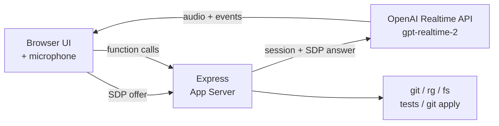

# Voice Pair Programmer

ブラウザのマイクから OpenAI **Realtime API (`gpt-realtime-2`)** に直接接続し、ローカルリポジトリを音声で読み取り・調査・パッチ提案できる **Codex App Server スタイルの検証用プロトタイプ**です。

ファイル変更はすべて UI 上での **人間の承認** を経てから適用されるため、安心して試せます。

> 🔬 これは検証用リポジトリです。実プロダクトではなく、Codex App Server パターンと GPT-Realtime-2 を組み合わせたときの操作感・実装パターンを確かめることを目的にしています。

---

## 目次

1. [できること](#できること)
2. [必要なもの](#必要なもの)
3. [3 分セットアップ](#3-分セットアップ)
4. [初回起動と最短の使い方](#初回起動と最短の使い方)
5. [プロジェクトの追加と切り替え](#プロジェクトの追加と切り替え)
6. [音声プリセット (Voice profile)](#音声プリセット-voice-profile)
7. [試してほしいプロンプト](#試してほしいプロンプト)
8. [パッチ承認フロー](#パッチ承認フロー)
9. [環境変数リファレンス](#環境変数リファレンス)
10. [トラブルシューティング](#トラブルシューティング)
11. [アーキテクチャ](#アーキテクチャ)
12. [安全モデル](#安全モデル)

---

## できること

- **ブラウザ ↔ OpenAI Realtime** の双方向音声セッション (WebRTC, `/v1/realtime/calls`)
- **ローカルワークスペース調査ツール** をモデルに公開
  - `workspace_status` — `git status`
  - `search_workspace` — `rg` による全文検索
  - `read_file` — ファイル読み取り
  - `git_diff` — ワーキングツリー差分
  - `run_tests` — `npm test`(または `TEST_COMMAND`)実行
  - `propose_patch` — 統一 diff のパッチ提案 (人間承認必須)
- **テキスト入力** によるフォールバック(声を出せない場面用)
- **Voice profile**: 5 種類のブラウザ側エフェクト(無線風、ロボ風など)
- **パッチ承認 UI**: 提案された diff を確認してから Apply
- **複数プロジェクト対応**: ローカル Git リポジトリを登録して切り替え

---

## 必要なもの

| ツール | 用途 |
| --- | --- |
| **Node.js 20+** | サーバー / クライアント実行 |
| **npm** | 依存インストール |
| **`rg` (ripgrep)** | `search_workspace` ツールに必須 |
| **OpenAI API キー** | `gpt-realtime-2` が利用できるプロジェクト |
| **モダンブラウザ** | WebRTC + Web Audio (Chrome / Edge / Safari) |

`rg` のインストール例:

```bash
# macOS
brew install ripgrep
# Ubuntu / Debian
sudo apt install ripgrep
```

---

## 3 分セットアップ

```bash
# 1. クローンして依存をインストール
npm install

# 2. 環境変数ファイルを作成
cp .env.example .env

# 3. .env を編集 (最低限 OPENAI_API_KEY を入れれば動きます)
$EDITOR .env

# 4. 開発サーバー起動
npm run dev
```

ブラウザで **<http://localhost:8787>** を開きます。

---

## 初回起動と最短の使い方

1. ブラウザで **<http://localhost:8787>** を開く
2. 画面右上のステータスが **`IDLE`** になっていることを確認
3. **`CONNECT`** ボタン(緑のボタン)をクリック
4. 初回はマイク許可ダイアログが出るので **許可** する
5. ステータスが **`CONNECTED`** に変われば接続完了
6. マイクに向かって話しかける、もしくは下部の入力欄からテキスト送信

最初は試しに次のように話しかけてみてください:

> "Hello, are you there?"

応答が音声で返ってきたら成功です。プロジェクトを選んでいない状態でも音声チャットだけは動きます。

接続を切るときは **`DISCONNECT`** をクリック。マイクをミュートしたいときは **`MUTE`**。

---

## プロジェクトの追加と切り替え

リポジトリ調査やパッチ提案を試すには、対象の Git リポジトリを登録する必要があります。

### A. UI から探して追加(推奨)

1. **Active workspace** パネルの **`Find repositories`** ボタンをクリック
2. `PROJECT_SEARCH_ROOTS` で指定したディレクトリ配下から Git リポジトリを自動検出
   - 未指定の場合は、このアプリのリポジトリの親ディレクトリを検索します
3. 一覧から選んで追加

### B. パスを直接入力

1. 入力欄に **プロジェクト名** と **絶対パス** を入力
2. **`Add`** をクリック

### 切り替え

セレクタから既存プロジェクトを選ぶだけ。プロジェクトを切り替えると:

- 進行中の Realtime セッションは自動で **切断**
- 未承認のパッチは **クリア**
- 次回 `CONNECT` 時に新しいプロジェクトのコンテキストでセッションが始まる

プロジェクト一覧はサーバー側の `PROJECTS_FILE`(既定: `.voice-pair-programmer/projects.json`)に保存されます。

---

## 音声プリセット (Voice profile)

**Voice profile** パネルで、モデルからの応答音声にブラウザ側エフェクトをかけられます。Realtime API のモデル音声プリセットは変えないので、**接続中でも切り替え可能** です。

| プリセット | 雰囲気 |
| --- | --- |
| `Natural` | エフェクトなしのクリーン音声 |
| `Console AI` | 帯域を狭めた無線風 |
| `Starship` | 軽いディレイ + プレゼンス強調(コマンドデッキ風) |
| `Synthetic` | 軽い歪みを加えた機械的トーン |
| `Low Orbit` | フィルタを深くかけた低周波寄り |

---

## 試してほしいプロンプト

接続後、マイクまたはテキスト欄からどうぞ:

```
このリポジトリを調べて、どんなプロジェクトか教えて
```

```
認証周りのエラーハンドリングを検索して
```

```
サーバーのエントリポイントを読んで、リクエストの流れを要約して
```

```
テストを実行して
```

```
失敗しているテストに対するパッチを提案して。ただし適用はしないで
```

UI 下部の **`INSPECT`** / **`TESTS`** ボタンは、`workspace_status` と `run_tests` をワンクリックで叩くショートカットです。

---

## パッチ承認フロー

モデルがファイル変更を提案すると:

1. 右側パネルの **`PENDING PATCH`** に統一 diff が表示される
2. 内容を確認
3. **`APPLY`** をクリック → `git apply` でワーキングツリーに適用
4. 取り消したいときは **`DISCARD`**

**Apply するまでファイルは一切変更されません。** これがこのプロトタイプの安全モデルの中核です。

---

## 環境変数リファレンス

`.env` で設定できる項目:

| 変数 | 必須 | 既定値 | 説明 |
| --- | --- | --- | --- |
| `OPENAI_API_KEY` | ✅ | — | `gpt-realtime-2` を利用できる OpenAI API キー |
| `OPENAI_REALTIME_MODEL` |   | `gpt-realtime-2` | 利用する Realtime モデル ID |
| `OPENAI_REALTIME_VOICE` |   | `marin` | モデル音声プリセット (`marin`, `cedar`, `alloy` など) |
| `WORKSPACE_ROOT` |   | `process.cwd()` | 起動時の既定ワークスペース(プロジェクト未選択時のフォールバック) |
| `PROJECTS_FILE` |   | `.voice-pair-programmer/projects.json` | 登録済みプロジェクトの保存先 |
| `PROJECT_SEARCH_ROOTS` |   | このリポジトリの親ディレクトリ | `Find repositories` の検索対象。`:` または `;` 区切りで複数指定可 |
| `TEST_COMMAND` |   | `npm test` | `run_tests` ツールが実行するコマンド |
| `PORT` |   | `8787` | 開発サーバーのポート |

`.env.example` をコピーしてから編集するのが一番手早いです。

---

## トラブルシューティング

### `CONNECT` を押すと `insufficient_quota` が出る

OpenAI 側のクレジット不足、またはプロジェクト/組織のスペンドリミットに到達しています。

1. OpenAI ダッシュボードで請求情報・残クレジット・上限額を確認
2. 上限を上げるかクレジットを追加
3. **`npm run dev` を再起動**(`.env` の再読込のため)
4. 改めて **`CONNECT`**

### マイクが認識されない

- ブラウザのアドレスバーから localhost のマイク権限を確認
- macOS の場合、システム設定 → プライバシーとセキュリティ → マイク でブラウザを許可

### `search_workspace` が動かない

`rg` (ripgrep) が PATH に通っているか確認してください。

```bash
which rg
```

### 接続できたのに音声が再生されない

音声再生はブラウザのユーザー操作が必要です。`CONNECT` ボタンのクリック以外で接続している場合や、別タブで自動再生がブロックされていると無音になります。一度 `DISCONNECT` してから `CONNECT` を押し直してください。

---

## アーキテクチャ



- ブラウザは **SDP オファー** だけをサーバーに送る
- サーバーが OpenAI Realtime API に対してセッションを作り、**SDP アンサー** を中継
- 以降の音声 / イベントは WebRTC で **ブラウザ ↔ OpenAI 直結**
- 関数呼び出し(ツール実行)はデータチャネル経由でサーバーが処理
- **API キーはサーバー側にしか存在しない**

---

## 安全モデル

| 操作 | 実行タイミング |
| --- | --- |
| 読み取り系ツール (`workspace_status`, `search_workspace`, `read_file`, `git_diff`, `run_tests`) | モデルからの呼び出しで即実行 |
| ファイル変更 (`propose_patch`) | パッチを **保留**。UI で `APPLY` を押すまで適用されない |

`run_tests` はテストコマンドを実行するため、テストが副作用を持つプロジェクトでは挙動を確認した上で利用してください。

このアプリは **ローカル開発用プロトタイプ** です。閲覧・実行されてよいリポジトリだけを登録してください。

---

## ライセンス / 注意事項

- 検証用コードのため、本番運用は想定していません
- OpenAI Realtime API の利用料金は OpenAI 側の課金体系に従います
- パッチ適用は `git apply` を使うため、対象は Git ワーキングツリー配下のみ
